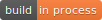
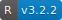
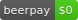

# Explore WhatsApp

   

**Explore WhatsApp** is an project aimed to analyze chat data. And fun!

In this early stages, the app only realizes basic exploratory analysis of chat text. I've included the next features:

1. Number of members in the conversation.
2. Total of messages in the conversation.
3. Most active member (person with more messages).
4. Total of messages by member.
5. Total of messages by weekday.
6. Total of messages by hour.
7. Top emoji usage by member.
8. Series time of messages by member.

In the near future, I would like to include more advance features related with the text itself (NLP). For example:

1. Sentimental Analysis based on chat (or emojis? 🤔)
2. Chat topic detection.
3. More beautiful visualizations.

Feel free to collaborate with the project or [contact me](mailto:iancastillorosales@gmail.com) 